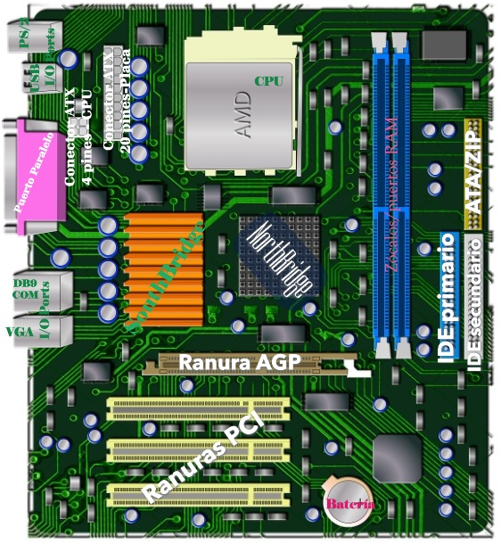

Identificación de Componentes de un Ordenador
---------------------------------------------

Dada una imagen de la placa base de un ordenador, identifica y etiqueta los siguientes componentes:

- **CPU** (Unidad Central de Procesamiento)
- **Memoria RAM** (Módulos de memoria)
- **Ranuras de expansión** (AGP, PCI)
- **Chipset** (Northbridge y Southbridge, si aplica, o un único chipset moderno)
- **Conectores de almacenamiento** (IDE, SATA, M.2)
- **Conectores de alimentación** (ATX de 24 pines, conector de CPU de 4/8 pines)
- **Puertos de E/S** (USB, Ethernet, Audio, etc.)

.. note::

    **Objetivo:** Reforzar el conocimiento práctico de los componentes físicos que conforman un sistema informático mediante la identificación visual y etiquetado de los principales elementos de una placa base. Este ejercicio te permitirá familiarizarte con la disposición y función de cada componente, facilitando su reconocimiento en situaciones reales.

-----

para realizar este ejercicio, sigue estos pasos:
1. **Obtener una imagen de la placa base**: Puedes buscar en línea una imagen de una placa base típica o utilizar una imagen de tu propio ordenador si tienes acceso a él.
2. **Identificar los componentes**: Utiliza la imagen para identificar los componentes mencionados anteriormente. Puedes hacer esto observando las etiquetas en la placa base o consultando el manual del fabricante si está disponible.
3. **Etiquetar los componentes**: Utiliza un software de edición de imágenes para añadir etiquetas a cada componente identificado en la imagen. Asegúrate de que las etiquetas sean claras y legibles.
4. **Guardar y compartir**: Guarda la imagen editada y compártela con tuinstructor o compañeros de clase según las indicaciones del ejercicio. Puedes utilizar plataformas como Google Drive, Dropbox o cualquier otra herramienta de colaboración que prefieras.
5. **Reflexionar sobre el ejercicio**: Después de completar el ejercicio, reflexiona sobre lo que has aprendido. ¿Qué componentes te resultaron más fáciles de identificar? ¿Hubo alguno que te sorprendió o que no conocías previamente? ¿Cómo se relacionan estos componentes entre sí para formar un sistema informático funcional?
6. **Discusión en grupo**: Si es posible, organiza una sesión de discusión con tus compañeros o instructor para compartir tus hallazgos y aprender de las experiencias de los demás. Esto puede ayudarte a consolidar tu conocimiento y aclarar cualquier duda que puedas tener.
7. **Revisión final**: Revisa tu trabajo para asegurarte de que todas las etiquetas sean correctas y que la imagen sea clara. Asegúrate de que has identificado todos los componentes requeridos y que tu trabajo cumple con los requisitos del ejercicio.
8. **Entrega**: Entrega tu imagen etiquetada según las instrucciones de tu instructor. Asegúrate de seguir cualquier formato o requisito específico que te hayan proporcionado.

